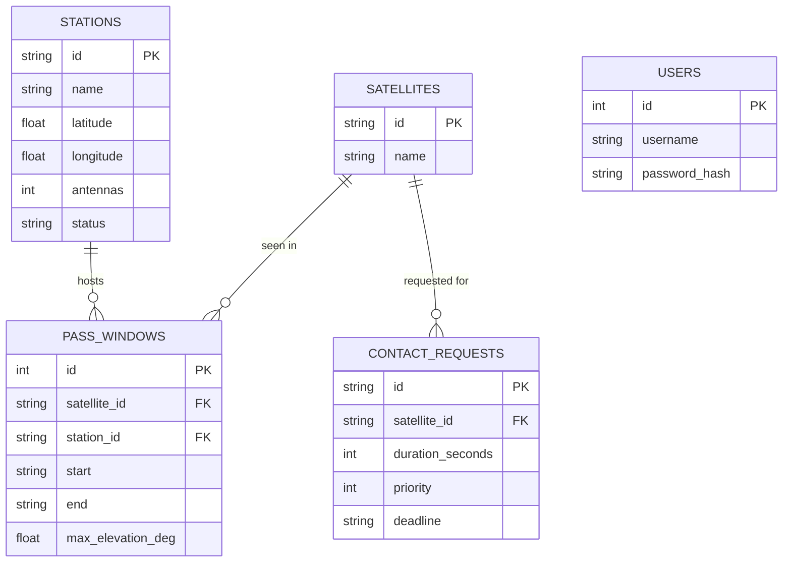

# Data model

The database stores the *inputs* to scheduling — the fleet, the ground network,
the pass windows, and the request queue — plus the user accounts. Scheduled
contacts are computed on demand (see [architecture](architecture.md)), so there
is no contacts table.

Notes:

- **Times** are stored as ISO-8601 strings so timezone-aware UTC survives on
  both SQLite and Postgres.
- **Priority** is a small integer (1 = low … 4 = critical).
- **Station status** is `online` or `offline`; offline stations are skipped by
  the scheduler, and their work is reassigned to other passes.
